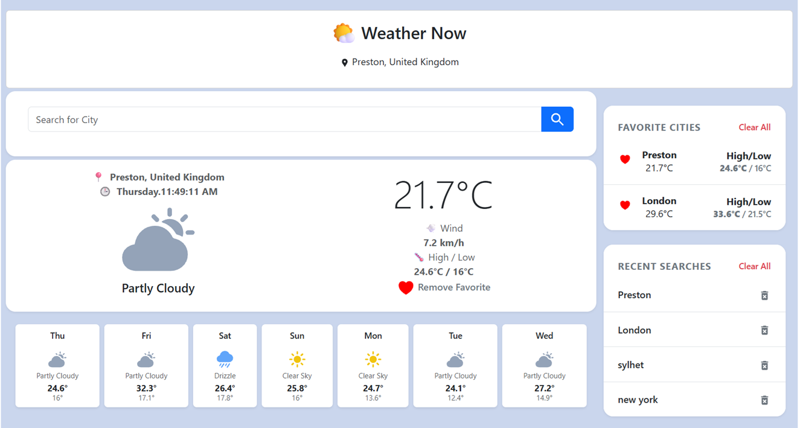
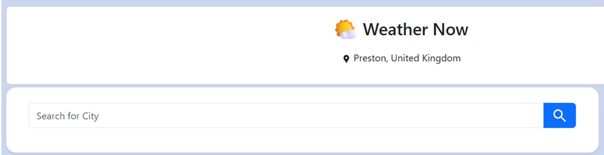
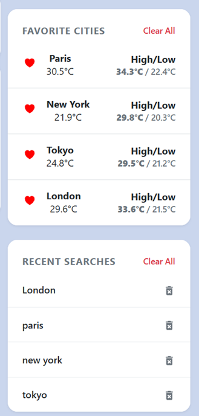
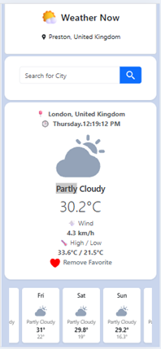

# 🌤️ Weather Now

A modern and responsive weather application built with **React** that allows users to search for weather information worldwide, save favorite cities, and view a 7-day weather forecast. The project focuses on clean architecture by separating UI, business logic, and API communication using reusable React components and custom hooks.

## 🚀 Live Demo

🔗 https://weather-app-react-9dn1.vercel.app/

---

## 📸 Screenshots

### Home Page


### Search Result


### Favorite Cities


### Mobile View


---

## ✨ Features

- 🌍 Search weather by city name
- 📍 Automatically detect the user's current location
- 🌡️ Display current weather conditions
- 📅 7-Day weather forecast
- ❤️ Save and manage favorite cities
- 🕒 Recent search history
- 💾 Persistent data using Local Storage
- 📱 Responsive design using Bootstrap 5
- ⚠️ Loading and error handling

---

## 🛠️ Technologies Used

### Languages


### Frontend


### Tools


---

## 📂 Project Structure

```text
src
│
├── components
│   ├── FavoriteCity.js
    ├── CommonSidebar.js
│   ├── ForecastCard.js
│   ├── Header.js
│   ├── Loading.js
│   ├── Error.js
│   ├── SearchForm.js
│   ├── SearchHistory.js
│   └── WeatherCard.js
│
├── hooks
│   ├── useFavorite.js
│   ├── useHistory.js
│   └── useWeather.js
│
├── services
│   └── weatherService.js
│
├── utils
│   ├── dateUtils.js
│   └── weatherUtils.js
│
├── Css
    ├── style.css
│   └── bootstrap.min.css
│
├── App.jsx
└── main.jsx
```

---

## 🧠 Architecture

The application follows a simple separation of concerns.

- **Components** are responsible for rendering the UI.
- **Custom Hooks** manage application state and business logic.
- **Services** handle communication with external APIs.
- **Utilities** contain reusable helper functions.

This keeps the code modular, reusable, and easier to maintain.

---

## ⚙️ Installation

Clone the repository

```bash
git clone https://github.com/shamsiasmriti34/weather-app-react.git
```

Navigate into the project

```bash
cd weather-app-react
```

Install dependencies

```bash
npm install
```

Run the development server

```bash
npm run dev
```

Build for production

```bash
npm run build
```

---

## 🎯 What I Learned

Building this project helped me improve my understanding of:

- React Components
- React Hooks
- Creating Custom Hooks
- State Management
- API Integration
- Local Storage
- Responsive Design
- Separation of Concerns
- Code Refactoring
- Project Structure

One of the biggest improvements during development was refactoring the application by extracting weather, favorites, and search history logic into reusable custom hooks, making the codebase much cleaner and easier to maintain.

---

## 🔮 Future Improvements

- 🌙 Dark Mode
- 🌡️ Celsius / Fahrenheit toggle
- 🕒 Hourly weather forecast
- 💧 Humidity and pressure information
- 🌅 Sunrise and sunset times
- 🗺️ Weather map integration
- ✨ Improved animations and transitions

---


## 🙏 Acknowledgements

- Open-Meteo API
- OpenStreetMap Nominatim API
- React
- Bootstrap
- React Icons

---

## 📫 Connect with Me

Author: Shamsia Sharmin

GitHub:
https://github.com/shamsiasmriti34


Email:
(shamsia.smriti34@gmail.com)

---

## ⭐ If you like this project

If you found this project helpful or interesting, consider giving it a ⭐ on GitHub.